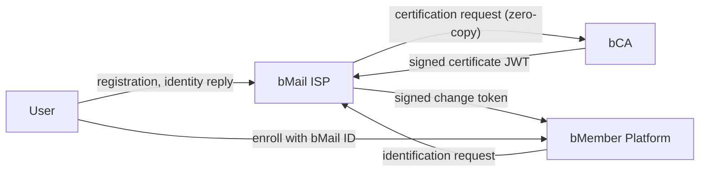

# bMail ID Infrastructure — Research PoC

An executable design-science artifact for *"A Prescriptive Design for Trustworthy Online Identifiers: The bMail ID Approach"* (Lee et al., 2025). The PoC turns the paper's four-stakeholder identity infrastructure into a guided, click-through demo with five end-to-end scenarios and webmail-style detail screens.

**Live demo:** [https://bmail-test-qq4f.vercel.app/](https://bmail-test-qq4f.vercel.app/)

---

## What you can demonstrate

| Scenario | Steps | What it shows |
|---|---|---|
| **S1. Register a bMail ID** | 5 | Fill in a real registration form, review the summary in a confirmation dialog, then watch the request travel User → ISP → bCA → ISP → User. A "Registration submitted" success card shows the submission reference and a four-step explanation of what happens next. PII stays at the bCA; the ISP holds only signed JWTs. |
| **S2. Migrate university email** | 5 | Move an expiring external email (`jpark@univ.edu`) onto a lifelong bMail ID. The Coupang member record is remapped via a signed change token while purchases and reviews are preserved, and the author tag flips to "Identifiable, verified purchase". |
| **S3. Phishing + Domain portal** | 3 | Query a lookalike domain (`bgmail.net`) in the public registry, record it as a fake intercept, then verify the suspected sender through their registered backup channel — never via the compromised email. |
| **S4. Trust labels in the inbox** | 3 | One batch domain sync attaches per-sender trust labels to the ten messages in the inbox. Verified senders (`bgmail.com`, `bnaver.com`) keep their badges; the two pending lookalikes (`bgmail.net`, `bgmail-services.com`) flip to suspicious. |
| **S5. Identification request** | 4 | A receiver (Coupang seller-verification) asks the ISP to confirm the sender. The sender must approve before the bCA issues an identification certificate — receiver-initiated, sender-gated, zero-copy. |

Each scenario is driven by clicking the real UI control inside the relevant tab — a form Submit button, a row inside an operator inbox, the Report-phishing button inside an open message. A thin progress bar at the top of the screen simulates the network round-trip, and most actions display a brief "Submitting…" state on the button itself.

---

## Quickstart (local)

```bash
cd poc
npm install
npm run dev
```

Open `http://localhost:5173`. The bottom-right panel lists the five scenarios, walks through the active one (which tab to be on, which highlighted control to click next, where you are in the multi-actor flow), and shows progress squares with a vertical actor flow diagram. S1 (registration submit), S2 (migration banner), and S3 (`bgmail.net` domain lookup) also auto-start when the relevant control is pressed directly, without first picking the scenario from the panel.

---

## Five-tab product shell

The top bar carries a `b` brand mark on the left, the five tabs in the middle, and a signed-in user chip ("Jiyeon Park" + current address) on the right.

- **Dashboard** — KPI strip (verified domains, issued IDs, migrated accounts, identifiable reviews) plus colour-coded security and account alerts, and a recent-activity feed.
- **Mail** — A real-feeling mailbox: Compose button, search field, refresh icon, message counter (1–10 of 10), Inbox / Sent / Archive / Account settings folder chips, a ten-message dense list (sender + small trust badge + subject + preview + time), a detail page with avatar, Gmail-style `mailed-by` / `signed-by` security strip, full multi-paragraph body, Reply / Forward / Archive / Report phishing actions, plus the bMail registration form with a confirmation modal and success screen.
- **ISP Console** — Operator stats (registered users, IDs issued this session, certified domains, open verifications), the inbox of pending requests, the domain registry, recent fake-domain intercepts, an address-interpretation guide (real-name vs. anonymous vs. lookalike), the public domain lookup portal, the batch trust-label sync card, and the identification-requests log.
- **bCA (KT)** — Subscriber lookup with PII (real names, masked national IDs, phone numbers), the certificate ledger, and an audit-log notice under the Personal Information Protection Act. Stats highlight that the ISP holds zero PII records.
- **Coupang** — Marketplace operator console: 2.1M total members, 847K bMembers, the product-review trust layer (rating, helpful counts, "Identifiable author, verified purchase" tag), a Member-tier column (bMember vs standard), and the "Unreachable members — why the ID-change protocol matters" card that quantifies the customer-retention story (KRW 2.4B annually at risk).

---

## Four-stakeholder model



- **User** — owns the bMail ID, approves identity disclosures, initiates ID migration.
- **bMail ISP** — operates the domain registry, issues bMail IDs, orchestrates change tokens, gates identification requests behind sender approval. Holds no PII columns.
- **bCA (Certification Authority)** — holds the real PII (telco subscriber records). Issues signed certificate JWTs without ever transmitting the underlying data.
- **bMember Platform** — verifies change tokens, remaps member IDs, tags reviews from certified bMail authors as identifiable, and can submit identification requests for high-trust workflows.

---

## Repo layout

```
4_bmail/
├── prototype/     Initial HTML mockup (visual reference only)
├── poc/           Working demo (Vite + React + TS + Zustand)
│   ├── src/
│   │   ├── data/        Fixtures (actors, scenarios, domains)
│   │   ├── state/       Zustand store + scenario runner
│   │   ├── components/  TrustBadge, PendingRequest, Avatar, ProgressBar, ScenarioPanel
│   │   └── views/       DashboardView, UserView (mail), ISPView, BCAView, PlatformView
│   └── docs/flows/      Mermaid sequence diagrams for S1–S5
├── CLAUDE.md      Developer guide
└── README.md      This file
```

---

## How it works

- **No backend.** Every "API call" is a Zustand mutation wrapped in a 700 ms `setTimeout` so the top progress bar can play and buttons can flicker to "Processing…" / "Submitting…". Subscriber PII, certificates, change tokens, identification requests, and phishing reports all live in a single client-side store.
- **Single source of truth.** Whichever tab you're on, you're reading the same store. The bCA tab keeps subscriber records that the ISP tab provably never touches — the boundary is enforced at the data-model level, not just visually.
- **Scenarios decoupled from views.** Each scenario step carries `targetId`, `buttonLabel`, `instruction`, and optional `pendingTitle` / `pendingBody`. ISP / bCA / Platform steps render automatically inside the actor's "Inbox — pending requests" card; user steps anchor to specific UI affordances (form submit, banner CTA, mail row, Report button, approval toast).
- **Fixed fixtures.** One user (Jiyeon Park, `jpark@univ.edu` → `j.park@bgmail.com`), one bCA (KT Telecom), two certified ISP domains seeded in the registry (`bgmail.com`, `bnaver.com`), one marketplace (Coupang), and a ten-message inbox preseeded with a realistic mix of verified senders, regular non-bMail senders, and two unlabelled lookalikes (`bgmail.net`, `bgmail-services.com`) that get recorded as fake when S3 / S4 run.

---

## Design principles

- One accent color (indigo `#1F2A44`). No coloured status badges anywhere except the two deliberate exceptions below.
- No side navigation, no accent strips, no glow, no gradients. Visual hierarchy comes from type size, weight, and whitespace.
- **Two intentional colour exceptions, both grounded in the paper's argument:**
  - `TrustBadge` in the inbox — verified / suspicious / unverified / pending — uses a restrained palette plus a small SVG icon. This is the receiver-side trust signal the paper centres.
  - Dashboard `status-dot` and `alert-row` use the same restrained palette for security and account alerts.
- Top tabs only — never a left sidebar.

Detailed design notes and the procedure for adding a sixth scenario are in [CLAUDE.md](CLAUDE.md).

---

## Further reading

- [Developer guide](CLAUDE.md)
- [PoC quickstart](poc/README.md)
- [S1 Registration sequence diagram](poc/docs/flows/S1-registration.md)
- [S2 ID migration sequence diagram](poc/docs/flows/S2-id-change.md)
- [S3 Phishing + Domain portal sequence diagram](poc/docs/flows/S3-phishing-and-portal.md)
- [S4 Receiver inbox sequence diagram](poc/docs/flows/S4-inbox.md)
- [S5 Identification request sequence diagram](poc/docs/flows/S5-identification.md)

---

## Reference

Lee, J. K., et al. (2025). *A Prescriptive Design for Trustworthy Online Identifiers: The bMail ID Approach*. Manuscript not distributed with this repository.
