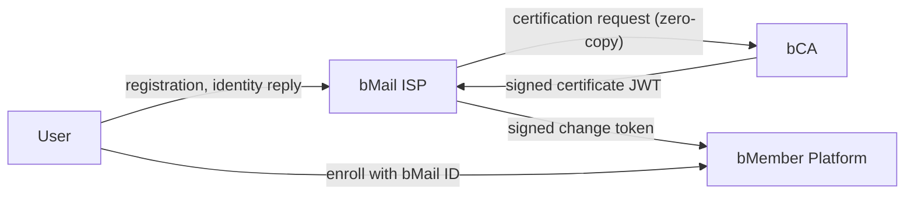

# bMail ID Infrastructure — Research PoC

An executable design-science artifact for *"A Prescriptive Design for Trustworthy Online Identifiers: The bMail ID Approach"* (Lee et al., 2025). The PoC turns the paper's four-stakeholder identity infrastructure into a guided, click-through demo.

**Live demo:** [https://bmail-test-qq4f.vercel.app/](https://bmail-test-qq4f.vercel.app/)

---

## What you can demonstrate

| Scenario | Steps | What it shows |
|---|---|---|
| **S1. Register a bMail ID** | 5 | Zero-copy certificate issuance. Fill out a real registration form, watch the request flow User → ISP → bCA → ISP → User. PII stays at the bCA; the ISP holds only signed JWTs. |
| **S2. Migrate university email** | 5 | Move an expiring external email (`jpark@univ.edu`) onto a lifelong bMail ID. Marketplace memberships, purchases, and reviews are preserved through a signed change token. |
| **S3. Phishing + Domain portal** | 3 | Look up a lookalike domain (`bgmail.net`) in the public registry, then verify the suspected sender through the registered backup channel — never via the compromised email. |
| **S4. Trust labels in the inbox** | 3 | Batch domain lookup attaches per-sender trust labels (`certified`, `suspicious`, `unverified`) to messages already sitting in the inbox. The recipient distinguishes senders at a glance. |

Each scenario is driven by clicking real UI controls in the mockup — a form Submit button, a pending request in an operator console, a Report-phishing button inside an open message. A thin progress bar at the top simulates the network round-trip.

---

## Quickstart (local)

```bash
cd poc
npm install
npm run dev
```

Open `http://localhost:5173`. Pick a scenario from the bottom-right panel. The panel tells you which actor's tab to switch to; the actual button you need to click is outlined inside that view.

---

## Four-stakeholder model



- **User** — owns the bMail ID, approves identity disclosures, initiates ID migration.
- **bMail ISP** — operates the domain registry, issues bMail IDs, orchestrates change tokens. Holds no PII columns.
- **bCA (Certification Authority)** — holds the real PII (telco subscriber records). Issues signed certificate JWTs without ever transmitting the underlying data.
- **bMember Platform** — verifies change tokens, remaps member IDs, tags reviews from certified bMail authors as identifiable.

---

## Repo layout

```
4_bmail/
├── source/        Original paper PDF
├── prototype/     Initial HTML mockup (visual reference only)
├── poc/           Working demo (Vite + React + TS + Zustand)
│   ├── src/
│   │   ├── data/        Fixtures (actors, scenarios, domains)
│   │   ├── state/       Zustand store + scenario runner
│   │   ├── components/  TrustBadge, PendingRequest, Avatar, ProgressBar, ScenarioPanel
│   │   └── views/       UserView (mailbox), ISPView, BCAView, PlatformView
│   └── docs/flows/      Mermaid sequence diagrams for S1–S4
├── CLAUDE.md      Developer guide
└── README.md      This file
```

---

## How it works

- **No backend.** Every "API call" is a Zustand mutation wrapped in a `setTimeout` so the progress bar can play. Subscriber PII, certificates, change tokens, and phishing reports all live in a single client-side store.
- **Single source of truth.** Whichever tab you're on, you're reading the same store. The bCA tab keeps subscriber records that the ISP tab provably never touches — that boundary is enforced at the data-model level, not just visually.
- **Scenarios decoupled from views.** Each scenario step has a `targetId` matching a real UI element. Clicking that element advances the scenario; the same store mutation could be triggered from a different UI element later without touching scenario data.
- **Fixed fixtures.** One user (Jiyeon Park), one bCA (KT Telecom), one ISP domain (`bgmail.com`), one marketplace (Coupang), plus a single lookalike (`bgmail.net`). All inputs are preset to keep the demo path deterministic.

---

## Design principles

- One accent color (indigo `#1F2A44`). No coloured badges for status — labels are text.
- No side navigation, no accent strips, no glow, no gradients. Visual hierarchy comes from type size, weight, and whitespace.
- Trust labels (`certified`, `suspicious`, `unverified`) are the deliberate exception: they use restrained colour + a small SVG icon for accessibility. Everything else stays monochrome.
- Top tabs only — never a left sidebar.

Detailed design notes and the procedure for adding a fifth scenario are in [CLAUDE.md](CLAUDE.md).

---

## Further reading

- [Developer guide](CLAUDE.md)
- [PoC quickstart](poc/README.md)
- [S1 Registration sequence diagram](poc/docs/flows/S1-registration.md)
- [S2 ID migration sequence diagram](poc/docs/flows/S2-id-change.md)
- [S3 Phishing + Domain portal sequence diagram](poc/docs/flows/S3-phishing-and-portal.md)
- [S4 Receiver inbox sequence diagram](poc/docs/flows/S4-inbox.md)

---

## Reference

Lee, J. K., et al. (2025). *A Prescriptive Design for Trustworthy Online Identifiers: The bMail ID Approach*. PDF available under [`source/`](source/).
