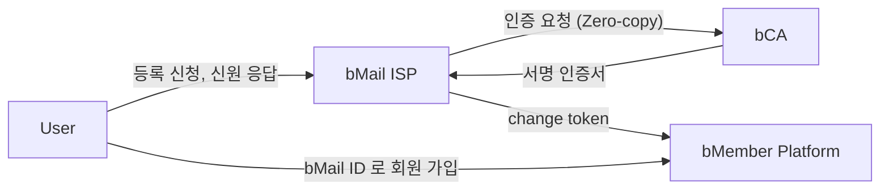

# bMail ID Infrastructure — Research PoC

논문 *"A Prescriptive Design for Trustworthy Online Identifiers: The bMail ID Approach"* (Lee et al., 2025) 의 4-stakeholder 신원 인프라를 시연용으로 구현한 디자인 사이언스 산출물(executable artifact) 이다.

## 시연 시나리오

| 시나리오 | 핵심 메시지 |
|---|---|
| **S1. Registration** | User → ISP → bCA Zero-copy 인증서 발급. PII 는 bCA 에만 남고 ISP 는 서명 토큰만 보관한다 |
| **S2. ID-change** | 만료 외부 ID 에서 bMail ID 로 이전, 플랫폼 회원·리뷰 이력은 그대로 보존한다 |
| **S3. Phishing + Domain portal** | 의심 메일을 백업 채널로 검증하고, 공개 도메인 등록부에서 위조 도메인을 가려낸다 |
| **S4. Receiver inbox** | 받은 편지함에서 발신자 도메인 기반 신뢰 라벨을 즉시 부착한다 |

## 빠른 실행

```bash
cd poc
npm install
npm run dev
```

브라우저에서 `http://localhost:5173` 접속 후 우측 하단 시나리오 패널에서 S1 → S4 순으로 실행한다.

## 4-stakeholder 모델



- **User** — bMail ID 등록, 신원 공개 요청 승인, ID 이전 개시
- **bMail ISP** — 도메인 발급·관리, 도메인 등록부 운영, 토큰 오케스트레이션 (PII 미저장)
- **bCA (Certification Authority)** — 실제 신원 PII 보관, 서명 인증서 발급
- **bMember Platform** — change token 검증, 회원 ID 재매핑, 식별 가능 작성자 태그

## 저장소 구성

```
4_bmail/
├── source/        논문 PDF (원본)
├── prototype/     초기 HTML mock (시각 레퍼런스, 차용하지 않음)
├── poc/           실제 시연 SPA
│   ├── src/       컴포넌트·상태·시나리오 정의
│   └── docs/      시퀀스 다이어그램 (mermaid)
└── CLAUDE.md      개발 가이드
```

## 기술 스택과 설계 결정

- **Vite + React + TypeScript + Zustand** 단일 SPA. 백엔드·데이터베이스·실제 JWT 서명은 의도적으로 포함하지 않는다.
- **단일 진실 소스** — Zustand 스토어가 4개 액터의 상태를 모두 보관한다. 어느 탭에서 보든 같은 데이터 위에서 본다.
- **시나리오와 뷰 분리** — 시나리오는 `(num, actor, message, apply)` 스텝 배열로 표현된다. 새 시연을 추가할 때 뷰 코드를 건드리지 않는다.
- **자유 입력 없음** — 시나리오 버튼만 제공한다. 시연 흐름이 깨지지 않도록 모든 입력값을 fixture 로 고정했다.

## 시연용 가상 데이터 (고정)

| 항목 | 값 |
|---|---|
| 사용자 | Jiyeon Park (만료 예정 외부 ID `jpark@univ.edu` 보유) |
| 인증 기관(bCA) | KT Telecom |
| ISP 도메인 | bgmail.com (정상), bnaver.com (정상), bgmail.net (위조) |
| 플랫폼 | Coupang (S2 의 ID 이전 대상) |
| 발급될 bMail ID | j.park@bgmail.com (S1 진행 후) |

## 디자인 원칙

AI 가 만든 티 없이 깔끔하게 보이도록 다음을 강제한다.

- 단일 액센트 색(인디고 `#1F2A44`) 만 사용한다. 상태 표시는 컬러 뱃지가 아닌 텍스트 라벨로 한다.
- 사이드바와 좌측 보더 강조 표현을 쓰지 않는다. 상단 탭 셸로 통일했다.
- 이모지, 중간점, 그라데이션, glow 효과를 쓰지 않는다.
- 시각 위계는 색이 아닌 크기·굵기·여백으로 만든다.

자세한 디자인 가이드와 시나리오 추가 절차는 [CLAUDE.md](CLAUDE.md) 에 있다.

## 더 읽기

- [개발 가이드](CLAUDE.md)
- [PoC quickstart](poc/README.md)
- [S1 Registration 시퀀스 다이어그램](poc/docs/flows/S1-registration.md)
- [S2 ID-change 시퀀스 다이어그램](poc/docs/flows/S2-id-change.md)
- [S3 Phishing + Domain portal 시퀀스 다이어그램](poc/docs/flows/S3-phishing-and-portal.md)
- [S4 Receiver inbox 시퀀스 다이어그램](poc/docs/flows/S4-inbox.md)

## 참고 논문

Lee, J. K., et al. (2025). *A Prescriptive Design for Trustworthy Online Identifiers: The bMail ID Approach*. (PDF 는 [source/](source/) 폴더 참고)
