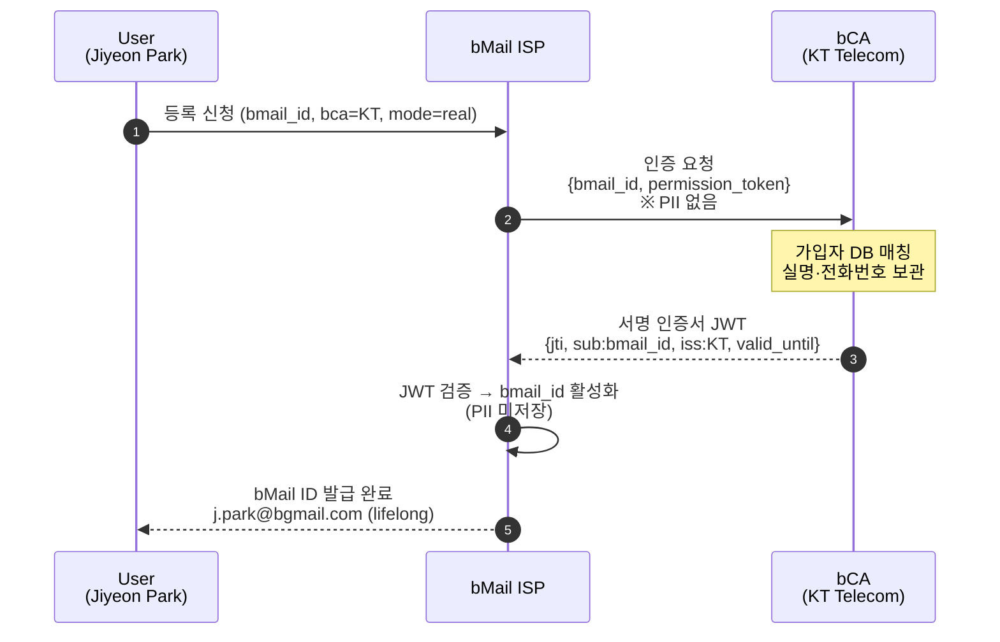

# S1. Registration — Zero-copy 인증서 발급

Jiyeon Park 이 신규 bMail ID(`j.park@bgmail.com`) 를 발급받는 등록 흐름이다. 핵심은 가입자 PII 가 bCA(KT) 에만 남고 ISP 는 서명된 인증서 JWT 만 보관한다는 점이다.

## 시퀀스 다이어그램

## 데이터 경계

| 항목 | bCA 에 존재 | ISP 에 존재 |
|---|:---:|:---:|
| 실명 (Jiyeon Park) | O | X |
| 주민번호 마스킹값 | O | X |
| 전화번호 | O | X |
| 가입자 ID (`sub-001`) | O | X |
| bMail 주소 | O (인증서 sub) | O |
| 인증서 JTI | O (발급 기록) | O (검증 기록) |
| 표시 이름 | X | O (사용자 입력) |
| 백업 채널(KakaoTalk 등) | X | O |

ISP 콘솔의 어떤 화면을 dump 해도 bCA 가 보관한 PII 컬럼이 노출되지 않는다.

## 시연 포인트

- **bCA 탭** 의 가입자 표에 실명·전화번호·주민번호 마스킹값이 있음을 보인다.
- **ISP 탭** 의 발급된 bMail ID 표에는 표시 이름·인증서 JTI·등록일만 있음을 대조한다.
- 우측 하단 시나리오 패널에서 단계 1 → 5 가 순차 진행되며 EventLog 에 timestamp 와 actor 라벨이 남는다.
