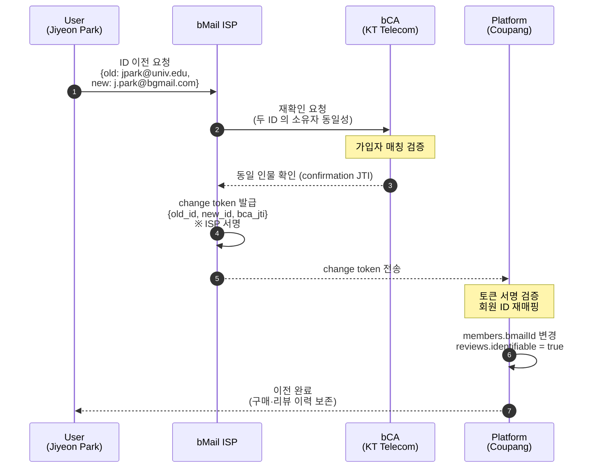

# S2. ID-change — 만료 외부 ID 에서 bMail ID 로 이전

학교 이메일(`jpark@univ.edu`) 이 곧 만료되는 상황에서 평생 식별자(`j.park@bgmail.com`) 로 회원 정보를 이전한다. 플랫폼(Coupang) 측은 회원 ID 만 재매핑하고 구매·리뷰 이력은 그대로 보존한다.

## 시퀀스 다이어그램

## 보존되는 데이터

| 필드 | 이전 전 | 이전 후 |
|---|---|---|
| 회원 ID (`platformMemberId`) | coupang-44120 | coupang-44120 (불변) |
| bMail / 외부 ID (`bmailId`) | jpark@univ.edu | j.park@bgmail.com |
| 가입일 | 2022-03-04 | 2022-03-04 (불변) |
| 구매 수 | 47 | 47 (불변) |
| 리뷰 수 | 12 | 12 (불변) |
| 리뷰 신뢰 태그 | 미식별 작성자 | 식별 가능 작성자 |

리뷰 본문, 평점, 작성일 등 모든 컨텐츠는 그대로 남는다. 리뷰의 작성자 신뢰 태그만 bMail 인증 회원으로 승격된다.

## 시연 포인트

- **Platform 탭** 의 회원 표에서 `bmailId` 컬럼이 `jpark@univ.edu` → `j.park@bgmail.com` 으로 바뀌고, 구매·리뷰 수는 그대로임을 강조한다.
- **ISP 탭** 의 "ID-change 토큰" 카드에 새 change token 의 JTI 와 구·신 ID 가 기록됨을 보인다.
- 리뷰 신뢰 계층 카드의 캡션이 "미식별 작성자" → "식별 가능 작성자" 로 전환되는 부분이 논문의 Social trust 구성 검증 지점이다.
