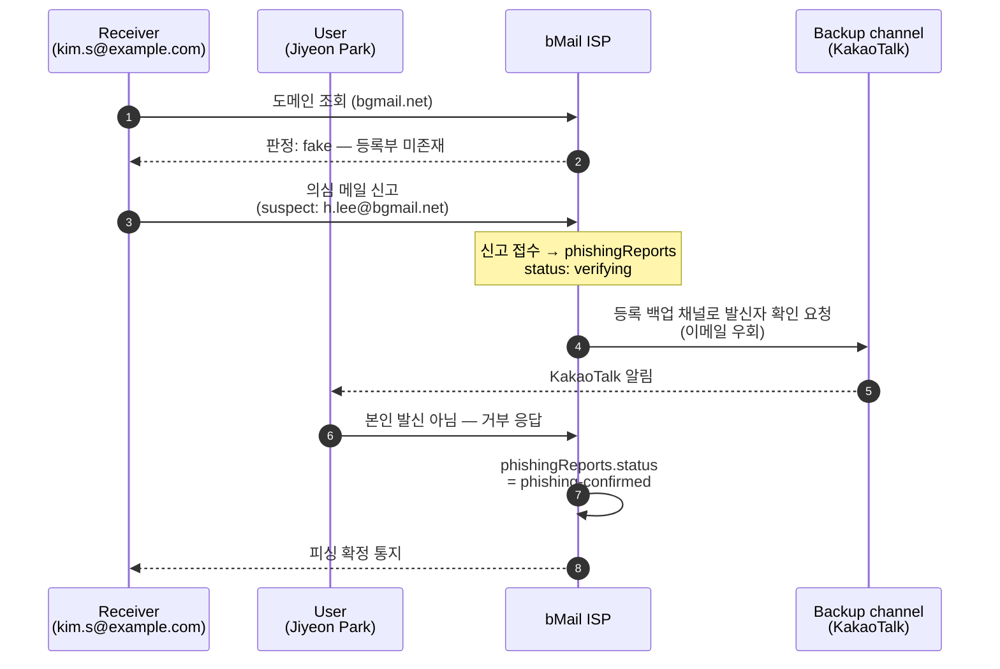

# S3. Phishing 검증 + Domain portal

위조 도메인(`bgmail.net`) 으로 발신된 의심 메일을 백업 채널로 검증한다. 동시에 누구나 ISP 의 공개 도메인 포털에서 도메인이 정상 등록 도메인인지 즉시 조회할 수 있다.

## 시퀀스 다이어그램

백업 채널 알림은 시연 PoC 에서 콘솔 stub 이며, 실제 KakaoTalk/SMS 전송은 구현하지 않는다. 시연에서는 Mailbox 탭 상단에 "Backup-channel verification (KakaoTalk)" 토스트가 떠서 진짜 발신자의 메신저 화면을 대신한다 — 의심 메일 자체를 열어 응답하는 구조가 아니다.

## 도메인 포털 판정 규칙

| 도메인 | 등록부 | DKIM | 판정 |
|---|---|---|---|
| `bgmail.com` | 등재 | pass | certified |
| `bnaver.com` | 등재 | pass | certified |
| `bgmail.net` | 미등재 (lookalike) | fail | fake |
| 그 외 미등재 | — | — | unknown |

판정은 등록부 일치 여부와 DKIM 상태로만 결정한다. SPF·DMARC 도 동일 라벨 체계로 확장 가능하지만 PoC 에서는 DKIM 단일 컬럼으로 압축했다.

## 시연 포인트

- **ISP 탭** 의 "공개 도메인 조회 포털" 카드에서 3개 버튼(`bgmail.com`, `bgmail.net`, `example.com`) 클릭 시 각각 다른 판정 카드가 노출됨을 보인다.
- 피싱 신고가 접수되면 같은 탭의 "피싱 신고" 카드 상태가 `verifying` → `phishing-confirmed` 로 전환된다.
- 발신자(User) 의 이메일이 아닌 **백업 채널** 로 확인 요청이 가는 부분이 논문의 핵심 메커니즘이다. 의심 메일 자체로 답신·확인하지 않음으로써 계정 탈취 시에도 검증이 깨지지 않는다.
