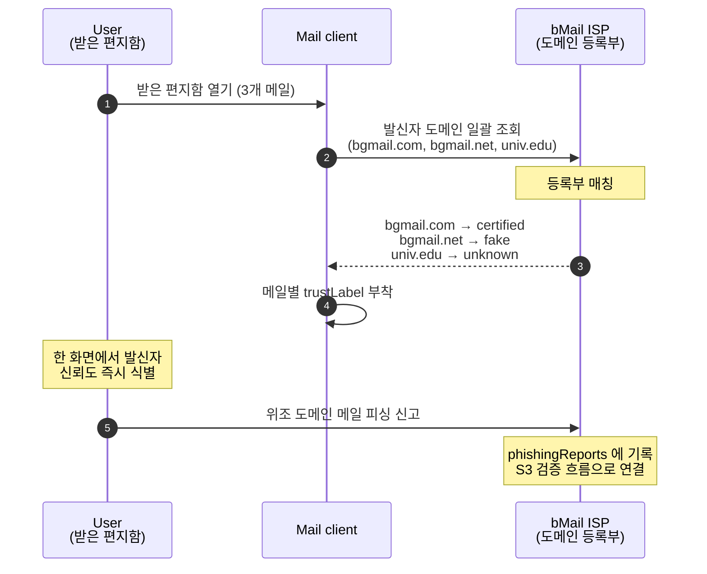

# S4. Receiver inbox — 받은 편지함에서 도메인 단위 식별

받은 편지함에 도착한 메일들을 도메인 등록부에 조회해 발신자별 신뢰 라벨을 부착한다. 식별 가능한 발신자, 위조 도메인 의심, 일반 미인증 도메인이 같은 화면에서 즉시 구분된다.

## 시퀀스 다이어그램

## 신뢰 라벨 규칙

| 메일 | 발신자 | 도메인 판정 | UI 라벨 |
|---|---|---|---|
| 공동 연구 미팅 일정 | prof.lee@bgmail.com | certified | `[certified]` 식별 가능 발신자 |
| bMail 계정 비밀번호 변경 | support@bgmail.net | fake | `[fake]` 위조 도메인 의심 |
| 졸업 행정 안내 | notice@univ.edu | unknown | `[unknown]` 일반 미인증 도메인 |

라벨은 색 뱃지가 아닌 mono 마커 + 회색 캡션으로 표시된다. 색상으로 시급도를 만들지 않고 텍스트로만 발신자의 도메인 지위를 알린다.

## 시연 포인트

- 같은 받은 편지함에 3개 발신자가 섞여 있는 상태에서 도메인 한 가지로 즉시 분류됨을 보인다.
- `bgmail.com` 과 `bgmail.net` 의 시각적 유사성에도 불구하고 등록부 조회 결과로 명확히 구분된다는 점이 핵심이다. 사용자가 도메인 문자열을 직접 비교할 필요가 없다.
- 단계 6 에서 신고가 발생하면 ISP 탭의 "피싱 신고" 카드에 새 항목이 추가된다 — S3 와 동일한 백업 채널 검증 흐름으로 자연스럽게 연결된다.
- 논문의 H5, H7(Social 메일 속성 → 수신자 채택) 검증 지점이다. 수신자가 메일을 한 눈에 분류할 수 있다는 시각적 증거가 된다.
