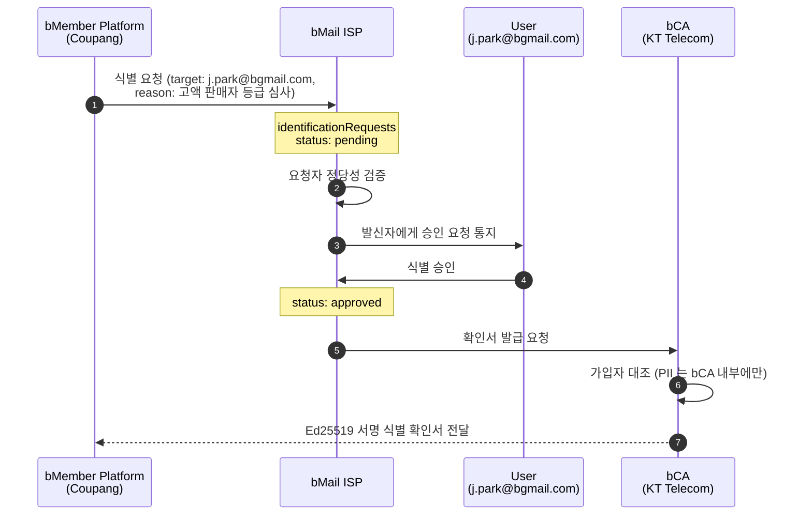

# S5. Identification request

수신 측(bMember 플랫폼) 이 발신자가 실제로 식별 가능한지 ISP 에 확인을 요청한다. 식별은 발신자 본인의 승인 없이는 진행되지 않으며, 승인 후에도 bCA 는 서명된 확인서만 발급하고 PII 는 bCA 밖으로 나가지 않는다. 논문의 Identifiability 프로토콜에 대응한다.

## 시퀀스 다이어그램

## 데이터 경계 규칙

| 데이터 | Platform | ISP | bCA |
|---|---|---|---|
| 식별 요청 (요청자·대상·사유) | 생성 | 보관 | — |
| 발신자 승인 여부 | — | 기록 | — |
| 가입자 PII (이름·전화·주민번호) | 없음 | 없음 | 보관 |
| 서명 확인서 (JTI) | 수신 | 중계 | 발급 |

## 시연 포인트

- 식별은 **발신자 승인 게이트** 를 반드시 통과한다. ISP 탭의 "Identification requests" 카드에서 `awaiting sender approval` → `approved by sender` 전환을 보인다.
- 승인 후에도 플랫폼이 받는 것은 **서명된 확인서뿐** 이다. bCA 탭의 발급 인증서 표에 `cert_kt_ident_2706103c` 가 추가되지만 가입자 표의 PII 는 어느 탭에도 복제되지 않는다.
- S1 의 Zero-copy 원칙이 식별 요청 흐름에서도 동일하게 유지됨을 강조한다.
